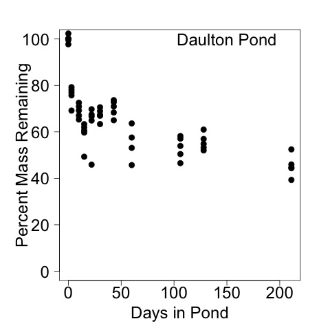
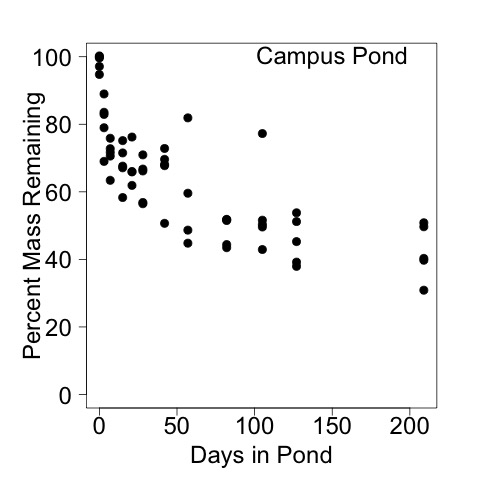
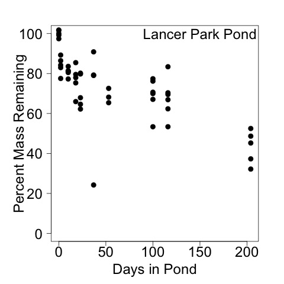

# Data Analysis for the Litter Decomposition Experiment Winter 2013 - 2014

## Purpose

The experiment was to assess the loss of mass from leaves in 3 ponds in Farmville VA.

## Date

* Created 19 Feb 2014

* Modified 24 March 2014

* Modified 11 June 2015 - KF - completed analysis with the latest data and updated code to remove the outlier from DP

* Modified 1 July 2015 - KF - added additional data summary for manuscript

* Modified 16 May 2016 - KF - modified figures for SFS 2016 talk

* Modified 3 Nov 2016 - KF - ANOVA on the final mass remaining

* Modified 2 Feb 2017 - KF - calculated time to mineralize 50% and 95% of leaf mass

## Author

KF

## Variable Descriptions

* T0.DP = the mean AFDM of the leaf packs that were placed in Daulton Pond and then immediately removed (g)

* T0.CP = the mean AFDM of the leaf packs that were placed in Campus Pond and then immediately removed (g)

* T0.LPP = the mean AFDM of the leaf packs that were placed in Lancer Park Pond and then immediately removed (g)

* prop.rem.DP = the proportion of the initial mass of leaves (T0.DP) remaining in a leaf pack sample on a sample day in Daulton Pond.

* prop.rem.CP = the proportion of the initial mass of leaves (T0.DP) remaining in a leaf pack sample on a sample day in Campus Pond.

* prop.rem.LPP = the proportion of the initial mass of leaves (T0.DP) remaining in a leaf pack sample on a sample day in Lancer Park Pond.

## Code

### Import Data

    leaf <- read.delim("./data/leaf_decomp_calc_2013-14.txt", header = T, stringsAsFactors = F)

### Calculate Percent Mass Remaining

#### Statistical Summary Across Ponds

Comparison of incubation duration

    with(leaf, tapply(days, lake, max, na.rm = T))

~~~~
Maximum days of deployment in the ponds

   Campus Pond     Daulton Pond Lancer Park Pond 
             209              211              204

~~~~

#### Daulton Pond

    T0.DP <- mean(leaf$AFDM[leaf$lake == "Daulton Pond" & leaf$days == 0], na.rm = T)
    prop.rem.DP <- 1 - ((T0.DP - leaf$AFDM[leaf$lake == "Daulton Pond"]) / T0.DP)

##### Remove Incorrect Point due to Missing Data

One of the points is basically 0 due to missing data

    leaf[128, ]

~~~~

          lake sample   date_col julian year    bag bag_leaf days cruc_num
128 Daulton Pond     48 12/21/2013    355 2013 7.3292   7.3293   60        4
    cruc_empty cruc_full cruc_ash leaf_mass leaf_mass_AFDM ash_mass_AFDM
128     27.487   30.2993  27.7033     1e-04         2.8123        0.2163
       propOM         AFDM
128 0.9230879 9.230879e-05

~~~~

to prevent this from affecting the calculation of k, I converted this value to NA in the data

    prop.rem.DP[58] <- NA

##### Statisitcal Summary

    summary(prop.rem.DP)

~~~~

 Min. 1st Qu.  Median    Mean 3rd Qu.    Max.    NAs 
 0.3931  0.5417  0.6495  0.6505  0.7083  1.0240 16.0000

~~~~

##### Graphical Analysis

Create the days axis

    day.axis.DP <- leaf$days[leaf$lake == "Daulton Pond"] 

    par(las = 1, mar=c(5, 6, 3, 3))
    plot(prop.rem.DP[prop.rem.DP > 0] * 100 ~ day.axis.DP[prop.rem.DP > 0], xlab = "Days in Pond", ylab = "Percent Mass Remaining", ylim = c(0, 100), pch = 19, cex = 1.5, cex.axis = 1.5, cex.lab = 1.5)
    text(150, 100, "Daulton Pond", cex = 1.5)
    dev.copy(jpeg, "./output/plots/DP_decomp_mass_remain.jpg")
    dev.off()

_Percent leaf pack mass remining in Daulton Pond by days in the pond_

##### Calculation of mass loss constant

    DP.k <- lm(log(prop.rem.DP[prop.rem.DP > 0]) ~ day.axis.DP[prop.rem.DP > 0])

    summary(DP.k)

~~~~

Call:
lm(formula = log(prop.rem.DP[prop.rem.DP > 0]) ~ day.axis.DP[prop.rem.DP > 
    0])

Residuals:
     Min       1Q   Median       3Q      Max 
-0.41291 -0.06924  0.00411  0.06316  0.33392 

Coefficients:
                               Estimate Std. Error t value Pr(>|t|)    
(Intercept)                  -0.3106079  0.0279081 -11.130 2.27e-15 
day.axis.DP[prop.rem.DP > 0] -0.0025201  0.0003272  -7.703 3.76e-10 
 
Residual standard error: 0.1525 on 52 degrees of freedom
  (16 observations deleted due to missingness)
Multiple R-squared: 0.5329,	Adjusted R-squared: 0.524 
F-statistic: 59.34 on 1 and 52 DF,  p-value: 3.761e-10 

 
~~~~

    plot(log(prop.rem.DP[prop.rem.DP > 0]) ~ day.axis.DP[prop.rem.DP > 0])
    abline(DP.k)
    dev.copy(png, "./output/plots/lnDP_decomp_mass_remain.png")
    dev.off()

_Natural log of proportion of leaf pack mass remining in Daulton Pond by days in the pond. Line is the best fit model.

##### Calculation of the time to 50% and 95% mass loss

Rearranging the linear model from:
 
~~~~
 
ln(prop.rem) = (m * days) + b

~~~~
 
to solve for days yields:
 
~~~~

days = (ln(prop.rem) - b) / m

~~~

so:
 
    days.50 <- (log(0.5) - coef(summary(DP.k))[1,"Estimate"]) / coef(summary(DP.k))[2,"Estimate"]

    days.50

~~~~
so the number of days it would take to remove 50% of the leaf mass is 

[1] 151.7942

~~~~

    days.5 <- (log(0.05) - coef(summary(DP.k))[1,"Estimate"]) / coef(summary(DP.k))[2,"Estimate"]

    days.5

~~~~
so the number of days it would take to remove 95% of the leaf mass is 

[1] 1065.476

~~~~
#### Campus Pond

    T0.CP <- mean(leaf$AFDM[leaf$lake == "Campus Pond" & leaf$days == 0], na.rm = T)
    prop.rem.CP <- 1 - ((T0.DP - leaf$AFDM[leaf$lake == "Campus Pond"]) / T0.CP)

##### Statistical Summary

    summary(prop.rem.CP)

~~~~

 Min. 1st Qu.  Median    Mean 3rd Qu.    Max.    NAs 
 0.3087  0.5075  0.6599  0.6558  0.7400  1.7580 11.0000 

~~~~

##### Graphical Analysis
    day.axis.CP <- leaf$days[leaf$lake == "Campus Pond"] 
    
    par(las = 1, mar = c(5, 6, 3, 3))
    plot(prop.rem.CP[prop.rem.CP > 0] * 100 ~ day.axis.CP[prop.rem.CP > 0], xlab = "Days in Pond", ylab = "Percent Mass Remaining", ylim = c(0, 100), pch = 19, cex = 1.5, cex.axis = 1.5, cex.lab = 1.5)
    text(150, 100, "Campus Pond", cex = 1.5)
    dev.copy(jpeg, "./output/plots/CP_decomp_mass_remain.jpg")
    dev.off()

_Percent leaf pack mass remining in Campus Pond by days in the pond_

##### Calculation of mass loss constant

    CP.k <- lm(log(prop.rem.CP[prop.rem.CP > 0]) ~ day.axis.CP[prop.rem.CP > 0])

~~~~

    summary(CP.k)

Call:
lm(formula = log(prop.rem.CP[prop.rem.CP > 0]) ~ day.axis.CP[prop.rem.CP > 
    0])

Residuals:
     Min       1Q   Median       3Q      Max 
-0.33930 -0.11056 -0.04142  0.08493  1.02793 

Coefficients:
                               Estimate Std. Error t value Pr(>|t|)    
(Intercept)                  -0.2657570  0.0395988  -6.711 9.62e-09 ***
day.axis.CP[prop.rem.CP > 0] -0.0034745  0.0004694  -7.403 6.78e-10 ***
---
Signif. codes:  0 ‘***’ 0.001 ‘**’ 0.01 ‘*’ 0.05 ‘.’ 0.1 ‘ ’ 1 

Residual standard error: 0.2187 on 57 degrees of freedom
  (11 observations deleted due to missingness)
Multiple R-squared: 0.4902,	Adjusted R-squared: 0.4812 
F-statistic:  54.8 on 1 and 57 DF,  p-value: 6.784e-10 

~~~~

    plot(log(prop.rem.CP[prop.rem.CP > 0]) ~ day.axis.CP[prop.rem.CP > 0])
    abline(CP.k)
    dev.copy(png, "./output/plots/lnCP_decomp_mass_remain.png")
    dev.off()

_Natural log of proportion of leaf pack mass remining in Campus Pond by days in the pond. Line is the best fit model._

##### Calculation of the time to 50% and 95% mass loss

Rearranging the linear model from:
 
~~~~
 
ln(prop.rem) = (m * days) + b

~~~~
 
to solve for days yields:
 
~~~~

days = (ln(prop.rem) - b) / m

~~~

so:
 
    days.50 <- (log(0.5) - coef(summary(CP.k))[1,"Estimate"]) / coef(summary(CP.k))[2,"Estimate"]

    days.50

~~~~
so the number of days it would take to remove 50% of the leaf mass is 

[1] 123.0073

~~~~

    days.5 <- (log(0.05) - coef(summary(CP.k))[1,"Estimate"]) / coef(summary(CP.k))[2,"Estimate"]

    days.5

~~~~
so the number of days it would take to remove 95% of the leaf mass is 

[1] 785.7149

~~~~

#### Lancer Park Pond

    T0.LPP <- mean(leaf$AFDM[leaf$lake == "Lancer Park Pond" & leaf$days == 0], na.rm = T)
    prop.rem.LPP <- 1 - ((T0.LPP - leaf$AFDM[leaf$lake == "Lancer Park Pond"]) / T0.LPP)

##### Statistical Summary

    summary(prop.rem.LPP)

~~~~

 Min. 1st Qu.  Median    Mean 3rd Qu.    Max.    NAs 
 0.2422  0.6619  0.7733  0.7420  0.8329  1.3100 20.0000

~~~~

##### Graphical Analysis

    day.axis.LPP <- leaf$days[leaf$lake == "Lancer Park Pond"]

    par(las = 1, mar = c(5, 6, 3, 3))
    plot(prop.rem.LPP[prop.rem.LPP > 0] * 100 ~ day.axis.LPP[prop.rem.LPP > 0], xlab = "Days in Pond", ylab = "Percent Mass Remaining", ylim = c(0, 100), pch = 19, cex = 1.5, cex.axis = 1.5, cex.lab = 1.5)
    text(150, 100, "Lancer Park Pond", cex = 1.5)
    dev.copy(jpeg, "./output/plots/LPP_decomp_mass_remain.jpg")
    dev.off()

_Percent leaf pack mass remining in Lancer Park Pond by days in the pond_

##### Calculation of mass loss constant

    LPP.k <- lm(log(prop.rem.LPP[prop.rem.LPP > 0]) ~ day.axis.LPP[prop.rem.LPP > 0])

~~~~

    summary(LPP.k)

Call:
lm(formula = log(prop.rem.LPP[prop.rem.LPP > 0]) ~ day.axis.LPP[prop.rem.LPP > 
    0])

Residuals:
     Min       1Q   Median       3Q      Max 
-1.14646 -0.06578  0.01058  0.11865  0.58875 

Coefficients:
                                 Estimate Std. Error t value Pr(>|t|)    
(Intercept)                    -0.1618811  0.0445881  -3.631 0.000685 ***
day.axis.LPP[prop.rem.LPP > 0] -0.0029604  0.0005181  -5.714 6.84e-07 ***
---
Signif. codes:  0 ‘***’ 0.001 ‘**’ 0.01 ‘*’ 0.05 ‘.’ 0.1 ‘ ’ 1 

Residual standard error: 0.2301 on 48 degrees of freedom
  (20 observations deleted due to missingness)
Multiple R-squared: 0.4048,	Adjusted R-squared: 0.3924 
F-statistic: 32.65 on 1 and 48 DF,  p-value: 6.836e-07 

~~~~

    plot(log(prop.rem.LPP[prop.rem.LPP > 0]) ~ day.axis.LPP[prop.rem.LPP > 0])
    abline(LPP.k)
    dev.copy(png, "./output/plots/lnLPP_decomp_mass_remain.png")
    dev.off()

_Natural log of proportion of leaf pack mass remining in Lancer Park Pond by days in the pond. Line is the best fit model._

##### Calculation of the time to 50% and 95% mass loss

Rearranging the linear model from:
 
~~~~
 
ln(prop.rem) = (m * days) + b

~~~~
 
to solve for days yields:
 
~~~~

days = (ln(prop.rem) - b) / m

~~~

so:
 
    days.50 <- (log(0.5) - coef(summary(LPP.k))[1,"Estimate"]) / coef(summary(LPP.k))[2,"Estimate"]

    days.50

~~~~
so the number of days it would take to remove 50% of the leaf mass is 

[1] 179.4547

~~~~

    days.5 <- (log(0.05) - coef(summary(LPP.k))[1,"Estimate"]) / coef(summary(LPP.k))[2,"Estimate"]

    days.5

~~~~
so the number of days it would take to remove 95% of the leaf mass is 

[1] 957.2379

~~~~
 
### Analysis of the Percent Mass Remaining at the End of the Exp

Due to the setup of the data.frame, I could not effectively select out the proportion of leaf litter remaining on the last day. I was getting a lot of issues with just getting NAs for some reason.  It isn`t clear to me why [] selects NAs as fulfilling the conditional...

Anyway, I created separate data frames for each of the ponds and then selected out the data from the final day

#### Data Frame Creation
    LPP.prop.rem <- data.frame(prop.rem.LPP, leaf$days[leaf$lake  == "Lancer Park Pond"])
    names(LPP.prop.rem) <- c("prop.rem.LPP", "days")

    CP.prop.rem <- data.frame(prop.rem.CP, leaf$days[leaf$lake  == "Campus Pond"])
    names(CP.prop.rem) <- c("prop.rem.CP", "days")

    DP.prop.rem <- data.frame(prop.rem.DP, leaf$days[leaf$lake  == "Daulton Pond"])
    names(DP.prop.rem) <- c("prop.rem.DP", "days")

#### Summary of the proportion of leaf mass remaining (g) on the final day of the incubation

##### LPP

    summary(LPP.prop.rem$prop.rem.LPP[LPP.prop.rem$days == 204])
    sd(LPP.prop.rem$prop.rem.LPP[LPP.prop.rem$days == 204], na.rm = T)
    
~~~~

 Min. 1st Qu.  Median    Mean 3rd Qu.    Max.    SD             NAs 
 0.3219  0.3730  0.4523  0.4318  0.4867  0.5250  0.08315351     20 

~~~~
 
##### CP

    summary(CP.prop.rem$prop.rem.CP[CP.prop.rem$days == 209])
    sd(CP.prop.rem$prop.rem.CP[CP.prop.rem$days == 209], na.rm = T)

~~~~
 
Min. 1st Qu.  Median    Mean 3rd Qu.    Max.     SD             NAs 
 0.3087  0.3974  0.4029  0.4228  0.4966  0.5084  0.08190044     10 

~~~~

##### DP
 
    summary(DP.prop.rem$prop.rem.DP[DP.prop.rem$days == 211])
    sd(DP.prop.rem$prop.rem.DP[DP.prop.rem$days == 211], na.rm = T)

~~~~
 
Min. 1st Qu.  Median    Mean 3rd Qu.    Max.    SD             NAs 
 0.3931  0.4436  0.4466  0.4535  0.4597  0.5246 0.04715929     15 

~~~~
 
#### Graphical Analysis
 
    par(las = 1)
    boxplot(LPP.prop.rem$prop.rem.LPP[LPP.prop.rem$days == 204], CP.prop.rem$prop.rem.CP[CP.prop.rem$days == 209], DP.prop.rem$prop.rem.DP[DP.prop.rem$days == 211], ylab = "Proportion of Leaf Mass Remaining on Final Day", ylim = c(0, 1), axes = F, col = 8)
    axis(1, c("LPP", "CP", "DP"), at = c(1, 2, 3))
    axis(2)
    box()
